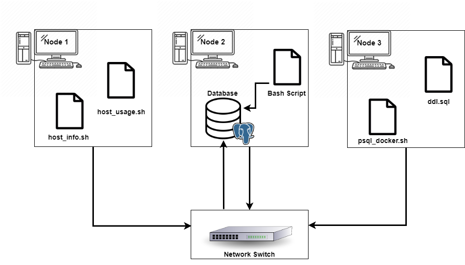

# Linux Cluster Monitoring Agent
## Introduction
The Linux Cluster Administration (LCA) Team has been assigned with the responsibility of managing a Linux cluster. The cluster consists of 10 nodes/servers all running on CentOS7 and are internally connected by a switch and can communicate through internal IPv4 addresses. The LCA team needs record the hardware specifications of each node and monitor node resource usage, such CPU and memory usage. The collected data will be in realtime and should be stored in a RDBMS database. The LCA team will use the usage and activity data of each node/server when making future business/ resource planning decisions. <br />
## Overview 
The Cluster monitoring solution presented below is minimum viable product (MVP), all testing has been conducted on a single machine rather then a cluster.  The collected data will be stored in a PostgreSQL database. All required scripts to start, stop and create a PostgreSQL instance in a Docker container is provided.  Scripts to collect and store hardware specification and usage data in the PostgreSQL instance are also provided in this solution.<br />
## Architecture and Design

The diagram above illustrates a three-node cluster internally connected by a switch.  Each node in the Linux cluster runs the Bash scripts `host_info` and `host_usage`. All data is then sent through the switch network and stored in the PSQL database, which is set up in Node 2.<br /> 
### Database tables
The PostgreSQL  database `host_agent`  contains two tables `host_info` and `host_usage`. Values in both tables contain a NOT NULL constraint. <br /> 

- `host_info`stores hardware specifications of each node/server of the host machine. Data is extracted only once from each node. This solution assumes hardware specifications are constant and do not change.<br/>
	-  `id`: Automatically generated unique ID numbers for each node. Primary key of this table.
	-  `hostname`: The full hostname of the node. Hostname is a Unique value.
	-  `cpu_number`: The number of CPU cores 
	- `cpu_architecture`: CPU architecture type 
	 -  `cpu_model`: Model name and type of CPU
	-  `cpu_mhz`: The speed of microprocessors; measured in GHz
	-  `L2_cache`: L2_cache size; measured in KB
	-  `total_mem`: Memory size of current node; measured in KB
	-  `timestamp`: UTC timestamp; time of data collection 

- `host_usage.sh`host_usage.sh collects the following usage information by each node every minute, this is done inorder to keep resource usage information up-to-date and to track usage over time.  <br />  
	-  `timestamp`: UTC timestamp; time of data collection
	- `host_id`: The ID of the current node. Foreign key references host_info id.	
	- `cpu_number`: The number of CPU cores
	- `memory_free`: Free memory available; measured in MB
	- `cpu_idle`: CPU idle; measured in percentage 
	- `cpu_kernel`: CPU kernel usage; measured in percentage 
	- `L2_cache`: L2_cache size; measured in kB
	- `disk_io`: The number of current disk I/O operations in progress
	- `disk_available`: Disk space available; measured in MB


## Script Description 
- [psql docker](linux_sql/scripts/psql_docker.sh) is used to create and start/stop a docker container. When docker container is started a PostgreSQL instance is run.
- [host info](linux_sql/scripts/host_info.sh) is run once on every node in the Linux cluster system in order to collect hardware configuration information of each node.  
- [host_usage](linux_sql/scripts/host_usage.sh) is run periodically on every node in the Linux cluster system in order to collect up-to-date hardware specification and to keep track of usage over time.
- [ddl](linux_sql/sql/ddl.sql) is used to automate the creation of `host-info` and `host_usage` tables in the ` host_agent` database and to eliminate all manual processes. 
- [queries](linux_sql/sql/linux_sql/sql/queries.sql) Is used to create two SQL queries in order to help the users manage the cluster more efficiently and to provide data for future resource planning purposes. 
  - The first query displays the total memory used by each node 
  - The second query calculates the average  amount of memory used by each node; calculated over a 5-minute interval.


## Usage
### Database and Table Initialization 
1)Provision a PostgreSQL instance by creating and starting a Docker container. </br>
     `./linux_sql/psql_docker.sh create db_username db_password`
2) Create `host_agent` database </br>
	`psql -h localhost -U postgres -W postgres=# CREATE DATABASE host_agent;`
3) Create Table `host_info` and `host_usage`</br>
	`psql -h localhost -U postgres -W -d host_agent -f ./linux_sql/sql/ddl.sql`
### host_info.sh Usage
This script only needs to be run once on every node in order to insert hardware specifications into table `host_info`. Note: this solution assumes that hardware specifications will not change.</br>
` ./linux_sql/scripts/host_infor.sh psql_host psql_port db_name psql_user psql_password`
## host_usage.sh Usage 
`host_usage.sh` will insert hardware usage data  into table `host_usage`. This script need to be executed continuously over a period of time in order to collect required data </br> </br>
` ./linux_sql/scripts/host_usage.sh psql_host psql_port db_name psql_user psql_password`
### Real time monitoring 
Use Crontab to continuously run `host_usage.sh` script, in one minute intervals. <br /> 
```
#Edit crontab
crontab -e 
# Add a crontab job 
* * * * * bash /home/centos/dev/jrvs/bootcamp/linux_sql/host_agent/scripts/host_usage.sh localhost 5432 host_agent postgres password > /tmp/host_usage.log
#To check all running crontabs
crontab -l
```
## Improvements 
1)`host_usage.sh` can collect a large amount of data in a short amount of time. By dding a script to calculate and store the average hardware usage over a time interval, then removing the data. Will allow user to collect accurate data while reducing database and storage size. 
2)This solution assumes that hardware specification will not change. By adding a helper script to detect hardware changes, also the solution to be more adaptable.
3)Create a script to detect faulty nodes and stop data collection from faulty nodes. Script will detect if node is no longer faulty then start data collection again. This will insure data collected in accurate. 

